# AWS trainings (FREE only!)

## AWS Educate / Emering Talent Community

Link: www.awseducate.com

**AWS Educate** offers free, beginner-friendly online trainings designed to introduce learners to cloud computing and Amazon Web Services (AWS). These courses cover foundational topics such as cloud concepts, AWS services, and basic technical skills for roles like cloud practitioner or developer. Each training includes short lessons, hands-on labs, and quizzes to reinforce learning. Assessments typically feature multiple-choice questions testing understanding of key AWS concepts and best practices, and a passing score unlocks a digital badge or certificate of completion.

| Training name                         | URL                                            | Badge                                                        |
| :------------------------------------ | ---------------------------------------------- | ------------------------------------------------------------ |
| Introduction to Cloud 101             | https://awseducate.instructure.com/courses/891 | 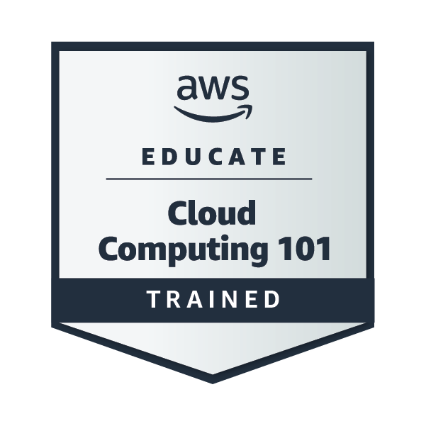 |
| Getting Started with Storage          | https://awseducate.instructure.com/courses/908 | 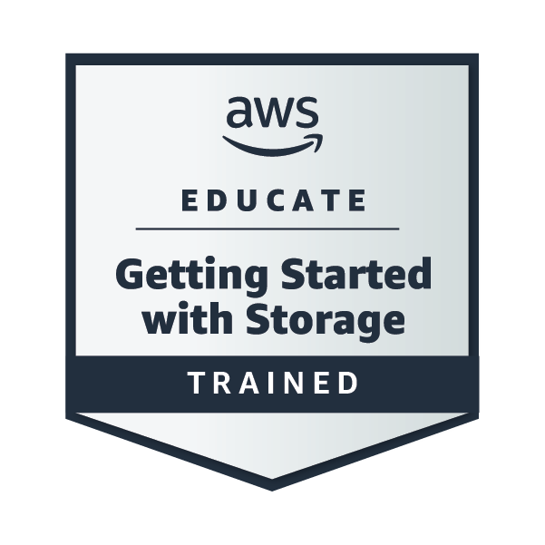 |
| Getting Started with Compute          | https://awseducate.instructure.com/courses/907 | 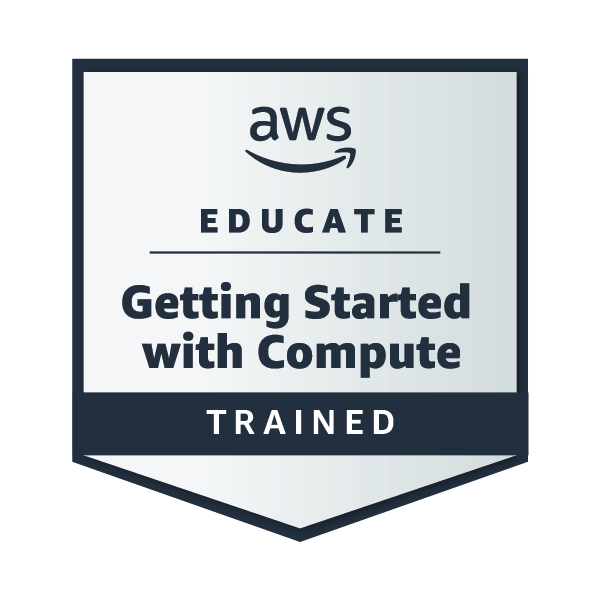 |
| Getting Started with Networking       | https://awseducate.instructure.com/courses/911 | 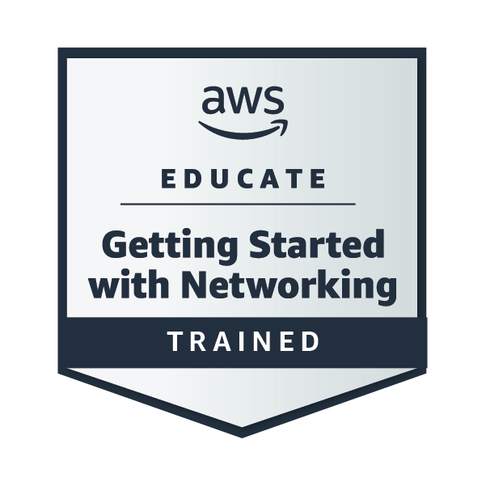 |
| Getting Started with Databases        | https://awseducate.instructure.com/courses/912 | 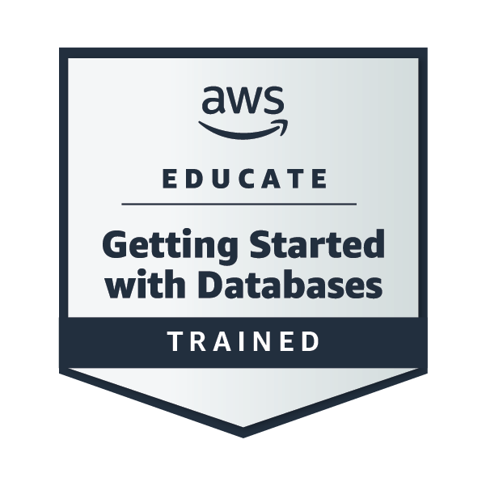 |
| Getting Started with Cloud Operations | https://awseducate.instructure.com/courses/889 |  |
| Getting Started with Security         | https://awseducate.instructure.com/courses/890 |  |
| Getting Started with Serverless       | https://awseducate.instructure.com/courses/905 |  |
| Machine Learning Foundations          | https://awseducate.instructure.com/courses/910 | 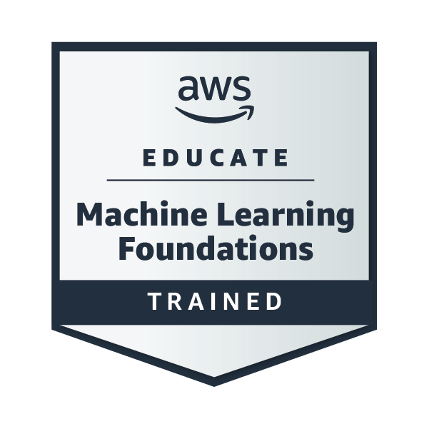 |
| AWS DeepRacer Primer                  | https://awseducate.instructure.com/courses/906 | 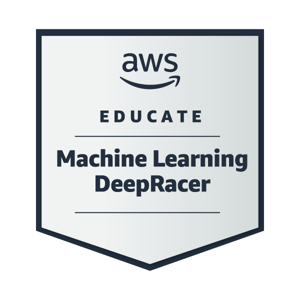 |
| Builder Labs                          | https://awseducate.instructure.com/courses/904 | 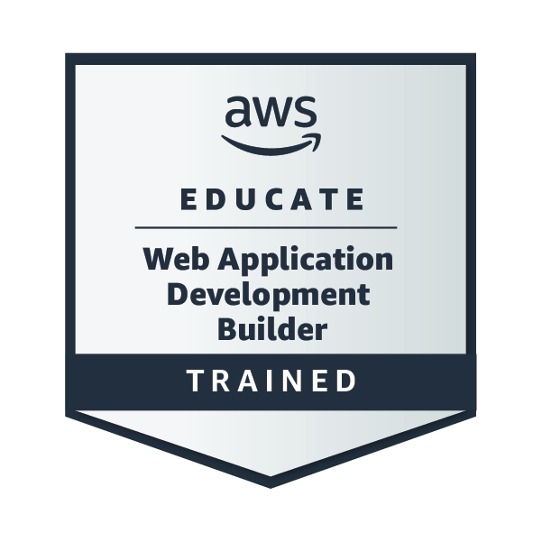 |

## SkillBuilder

Link: [explore.skillbuilder.aws](explore.skillbuilder.aws)

**AWS Skill Builder** is Amazon’s official online learning platform for cloud training and certification preparation. It offers a wide range of free and paid courses covering AWS fundamentals, technical skills, and role-based learning paths. The platform includes interactive labs, videos, and knowledge checks to reinforce learning. Users can also take official practice exams and earn digital badges or certificates upon completing certain courses or learning plans.

| Training name                   | URL  | Badge                                                        |
| ------------------------------- | ---- | ------------------------------------------------------------ |
| Microcredential: AWS Agentic AI Demonstrated | [Link](https://skillbuilder.aws/learn/32Y249P272/aws-agentic-ai-demonstrated/TTAJ5WKYTS) | img |
| Microcredential: AWS Serverless Demonstrated | [Link](https://skillbuilder.aws/learn/XV3B4RGA8Q/aws-serverless-demonstrated/BYD5SH8R5C) | img |
| AWS Knowledge: Cloud Essentials | [Link](https://skillbuilder.aws/learning-plan/XKS3J4FAS7/cloud-essentials--knowledge-badge-readiness-path--includes-labs/Y4YASRJEVX) | 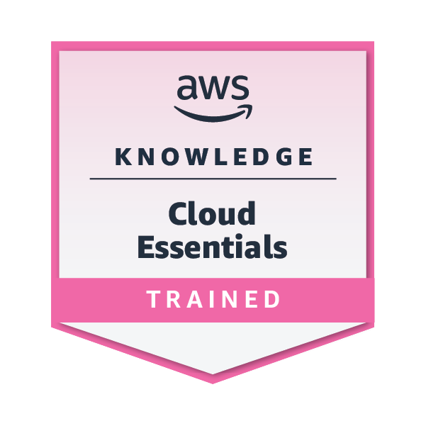 |
| AWS Knowledge: Architecting (Retired) |  | 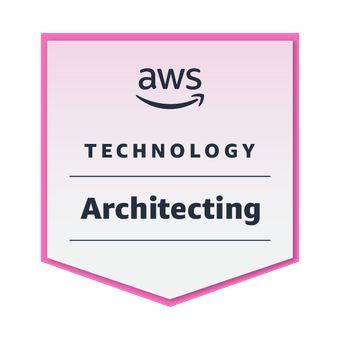 |
| AWS Knowledge: Object Storage | [Link](https://skillbuilder.aws/learning-plan/BJEHDY31SM/object-storage--knowledge-badge-readiness-path-includes-labs/TMJC4UK375) | 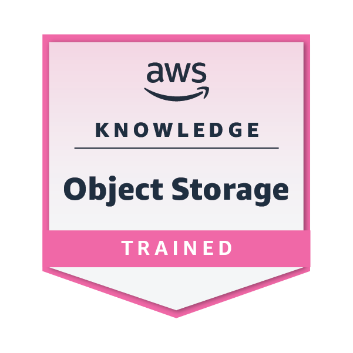 |
| AWS Knowledge: Block Storage | [Link](https://skillbuilder.aws/learning-plan/AN87FW2CF6/block-storage--knowledge-badge-readiness-path-includes-labs/T2TX3YPGD9) | 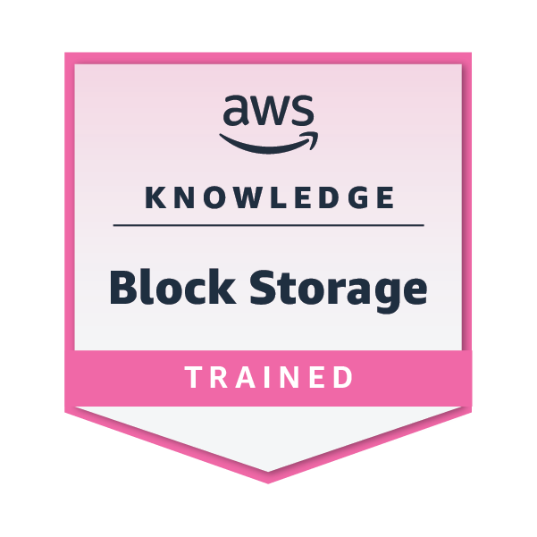 |
| AWS Knowledge: File Storage | [Link](https://skillbuilder.aws/learning-plan/P1BNDJZMPS/file-storage--knowledge-badge-readiness-path-includes-labs/YY96MNE9ER) | 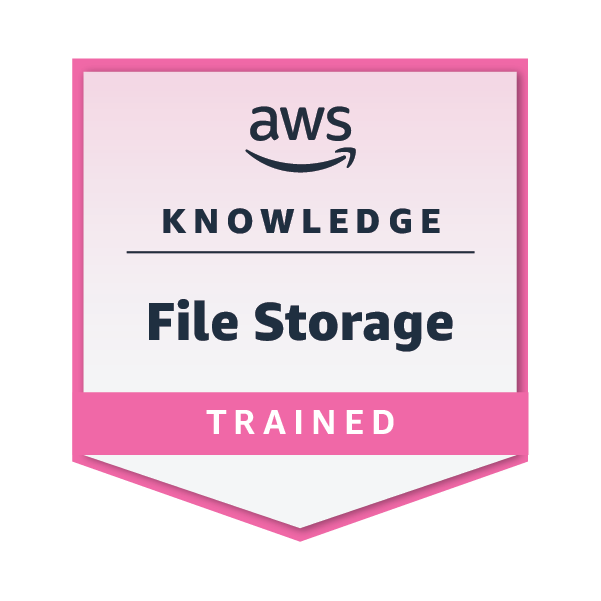 |
| AWS Knowledge: Data Migration | [Link](https://skillbuilder.aws/learning-plan/G7U9VGMVGK/storage-data-migration--knowledge-badge-readiness-path/M269NBTFYG) | 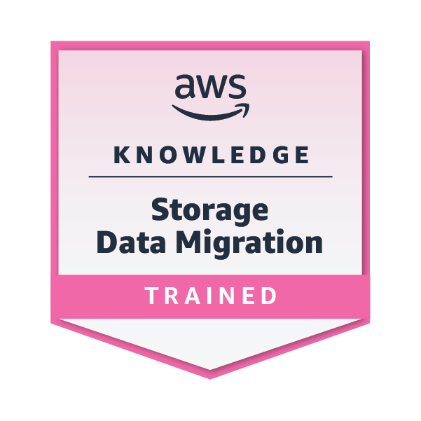 |
| AWS Knowledge: Data Protection & Disaster Recovery | [Link](https://skillbuilder.aws/learning-plan/YHGRS7J2UB/storage-data-protection-and-disaster-recovery--knowledge-badge-readiness-path/9CT121MZ6X) | 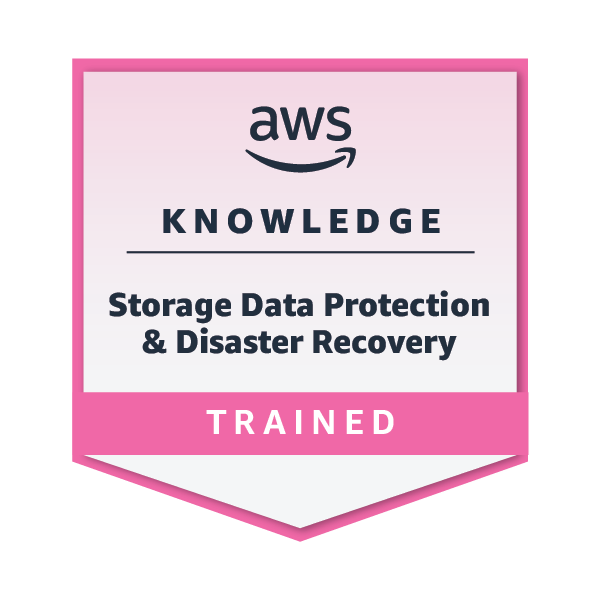 |
| AWS Knowledge: Networking Core | [Link](https://skillbuilder.aws/learning-plan/KG2Z8NEHYV/networking-core--knowledge-badge-readiness-path-includes-labs/ZDTDSRZ9NE) | 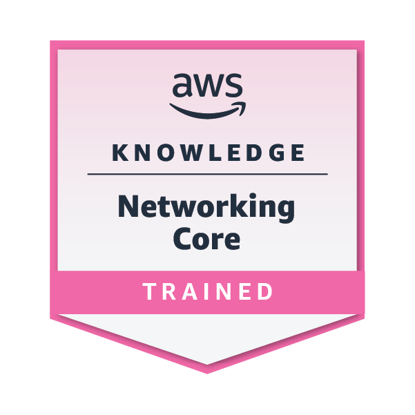 |
| AWS Knowledge: Compute | [Link](https://skillbuilder.aws/learning-plan/AE98BDMWT1/compute--knowledge-badge-readiness-path/6BA8EVB278) | 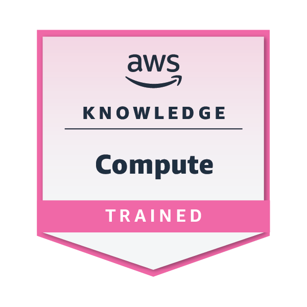 |
| AWS Knowledge: ECS          | [Link](https://skillbuilder.aws/learning-plan/BDJU9EAPJK/amazon-ecs--knowledge-badge-readiness-path/Q2R57WU6TT) | 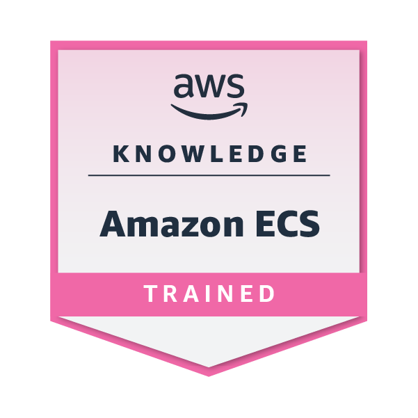 |
| AWS Knowledge: EKS          | [Link](https://skillbuilder.aws/learning-plan/FRN6Z7KMRY/amazon-eks--knowledge-badge-readiness-path/393YRXJZWC) | 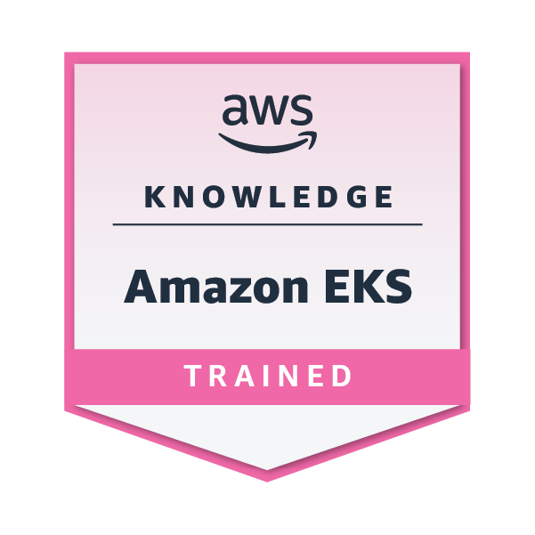 |
| AWS Knowledge: Serverless   | [Link](https://skillbuilder.aws/learning-plan/VD4SU58H3W/serverless--knowledge-badge-readiness-path-includes-labs/W62PSCYRZF) | 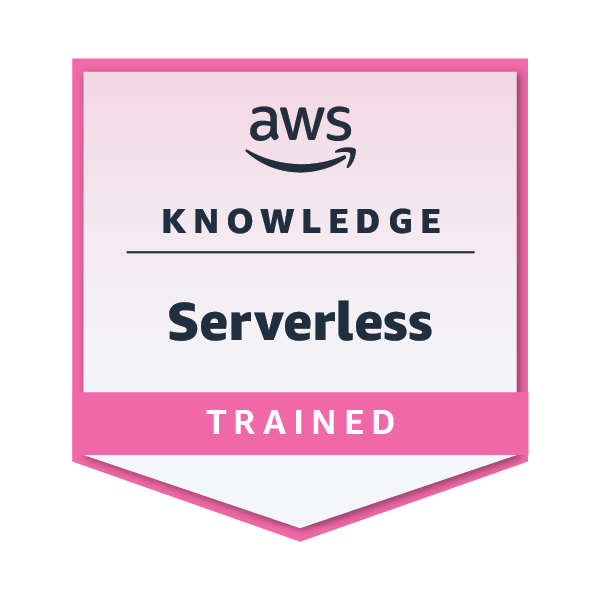 |
| AWS Knowledge: Events and Workflows   | [Link](https://skillbuilder.aws/learning-plan/QGZM6RSW3U/events-and-workflows--knowledge-badge-readiness-path-includes-labs/ZW2E4G2QR5) | 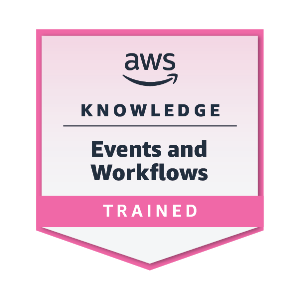 |
| AWS Knowledge: Amazon Braket (Quantum Computing) | [Link](https://skillbuilder.aws/learning-plan/EH35DWGU3R/amazon-braket--knowledge-badge-readiness-path-includes-labs/Y83VFAU54Z) | 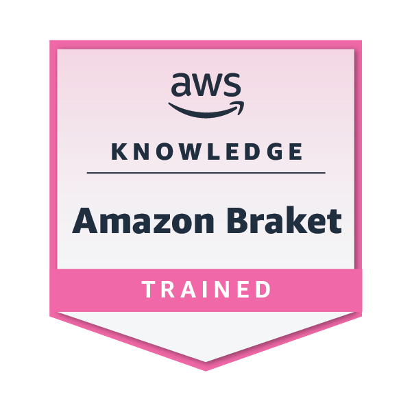 |
| AWS Knowledge: AWS for Games – Cloud Game Development | [Link](https://skillbuilder.aws/learning-plan/B1WF4NVB1T/aws-for-games-cloud-game-development--knowledge-badge-readiness-path/82SR2GXFUW) | 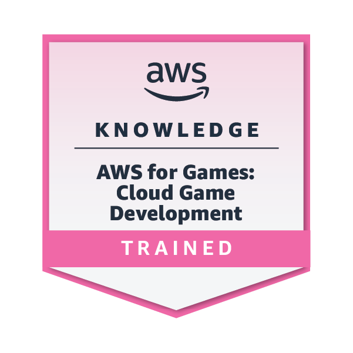 |
| AWS Knowledge: Media & Entertainment – Content Production Fundamentals | [Link](https://skillbuilder.aws/learning-plan/NRYV9FUNHH/aws-for-media--entertainment--content-production-foundations/QC7RDCH6A1) | 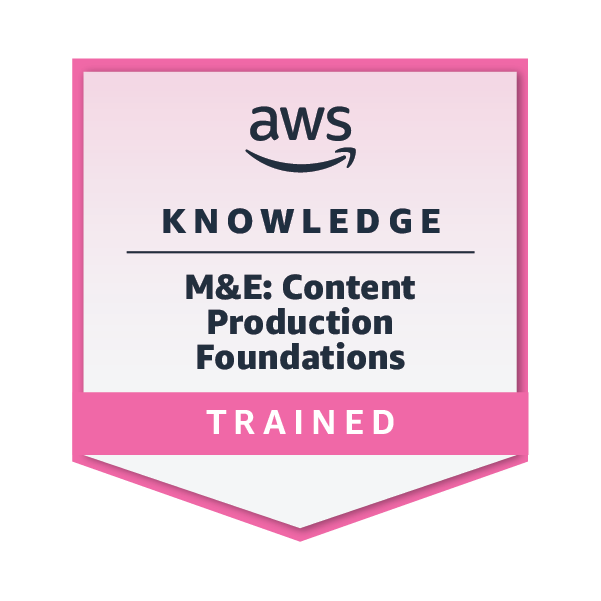 |
| AWS Knowledge: Media & Entertainment – Direct-to-Consumer and Broadcast Foundations | [Link](https://skillbuilder.aws/learning-plan/KH2WQGAZ83/media--entertainment-direct-to-consumer-and-broadcast-foundations--knowledge-badge-readiness-path/8U768R9N44) | 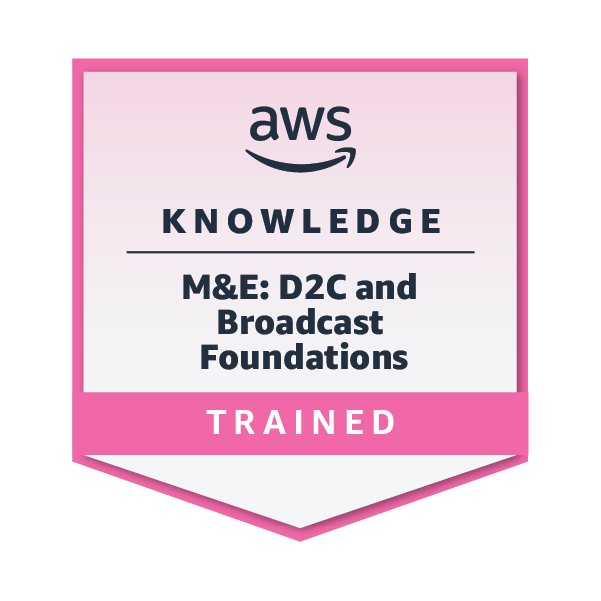 |
| AWS Knowledge: Amazon Connect Outbound Communications | [Link](https://skillbuilder.aws/learning-plan/5Z7Z7CZJSR/amazon-connect-outbound-communications--knowledge-badge-readiness-path/2SHNX8V3AQ) | 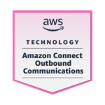 |
| AWS Knowledge: Amazon Connect Communications Specialist | [Link](https://skillbuilder.aws/learning-plan/KBRBGTSDJV/amazon-connect-communications-specialist-learning--badge-plan/8TNBGE9R6R) | 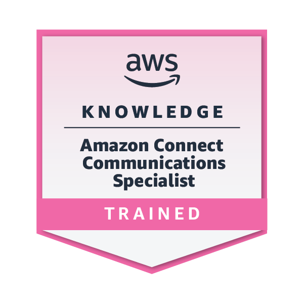 |
| AWS Knowledge: Amazon Connect AI Fundamentals | [Link](https://skillbuilder.aws/learning-plan/C75KRNZ9N7/amazon-connect-ai-fundamentals--knowledge-badge-readiness-path/D56C11BKKD) | 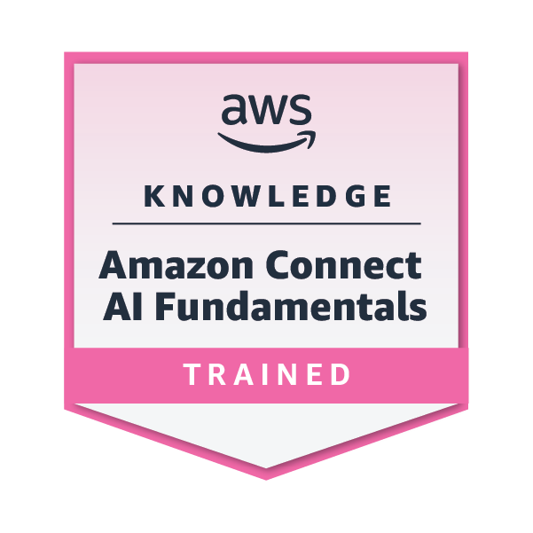 |
| AWS Knowledge: Amazon Connect Fundamentals | [Link](https://skillbuilder.aws/learning-plan/1EJ6WNS6XY/amazon-connect-fundamentals--knowledge-badge-readiness-path/D7Z2GEDGEY) | 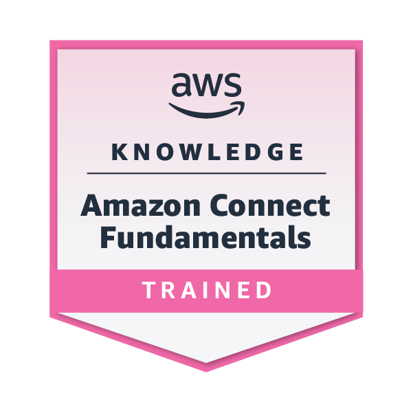 |
| AWS Knowledge: Amazon Connect Developer | [Link](https://skillbuilder.aws/learning-plan/6YW2QYUBKS/amazon-connect-developer-learning--badge-plan/NEWQZB4HAQ) | 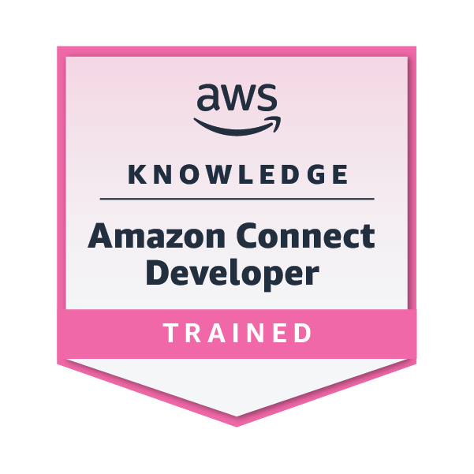 |
| AWS Knowledge: Amazon Connect Reporting & Analytics | [Link](https://skillbuilder.aws/learning-plan/8P99XA72ZK/amazon-connect-reporting--analytics--knowledge-badge-readiness-path/KGFNQVYY37) | 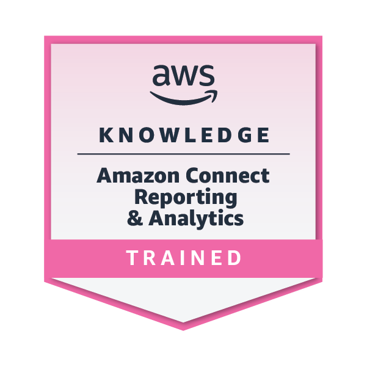 |
| AWS Knowledge: AWS Graviton | [Link](https://skillbuilder.aws/learning-plan/H8DNXE4QFY/aws-graviton--knowledge-badge-readiness-path/8KDUQ9U6UP) | 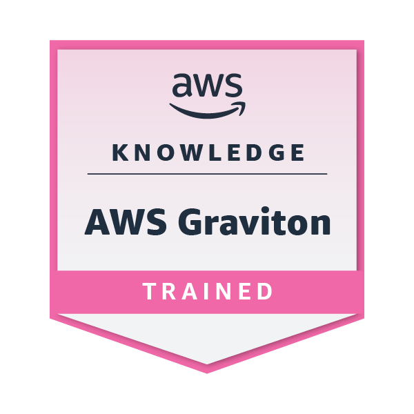 |
| AWS Knowledge: Business Intelligence | [Link](https://skillbuilder.aws/learning-plan/1U5N59C2UN/aws-business-intelligence-knowledge-badge-readiness-path/JK9FXA7E48) | 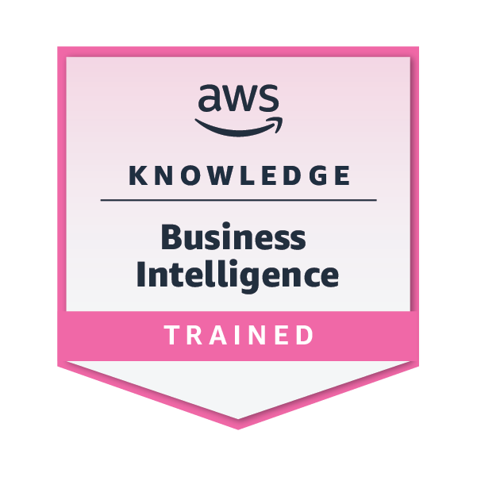 |
| AWS Knowledge: Amazon Q Developer Fundamentals | [Link](https://skillbuilder.aws/learning-plan/CH4MJ2PWUF/amazon-q-developer-knowledge-badge-readiness-path/D8VJ1EHK7H) | 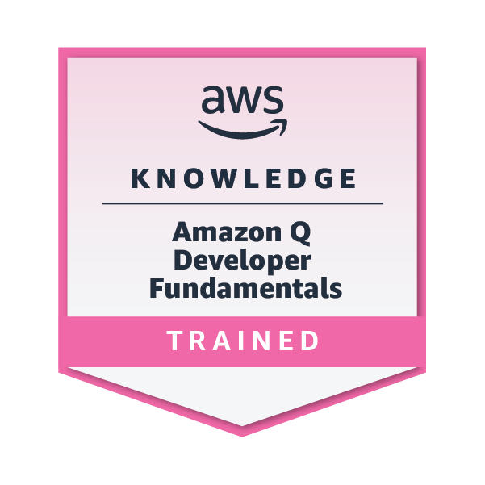 |
| AWS Knowledge: Advanced PostgreSQL for Amazon Aurora and Amazon RDS | [Link](https://skillbuilder.aws/learning-plan/VZ3TF49CG6/postgresql-for-amazon-aurora-and-amazon-rds--advanced-concepts-knowledge-badge-readiness-path)​ | 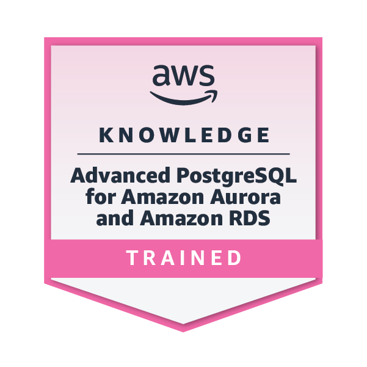 |
| AWS Knowledge: AWS End User Computing | [Link](https://skillbuilder.aws/learning-plan/DSUFK7XXH5/aws-end-user-computing--knowledge-badge-readiness-path/5Z9TY7PSE3)​ | 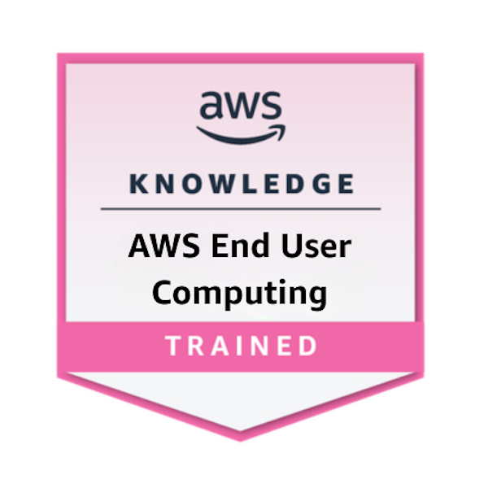 |
| AWS Knowledge: Security Champion | [Link](https://skillbuilder.aws/learning-plan/31WSD993AF/aws-security-champion--knowledge-badge-readiness-path/QGY41BBUDQ) | 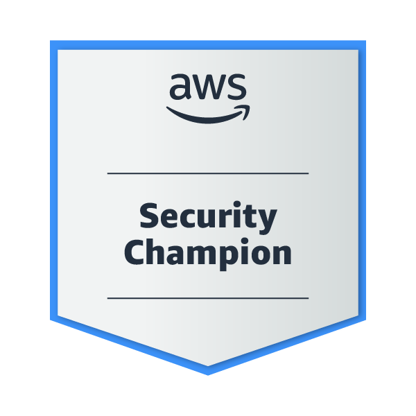 |

## Cloud Quest

Link:https://aws.amazon.com/training/digital/aws-cloud-quest/

**AWS Cloud Quest** is an interactive, game-based learning experience that helps users build practical cloud skills through virtual, scenario-driven challenges. Players complete real AWS tasks—such as deploying servers, managing databases, or securing environments—inside a simulated city. Each quest focuses on a specific role (e.g., Cloud Practitioner, Solutions Architect, Machine Learning Specialist). Progress is tracked through missions, quizzes, and hands-on labs, with successful completion earning digital badges that showcase practical AWS expertise.

### Cloud Practitioner (FREE)

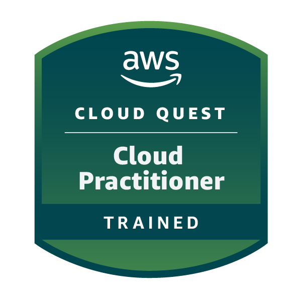

